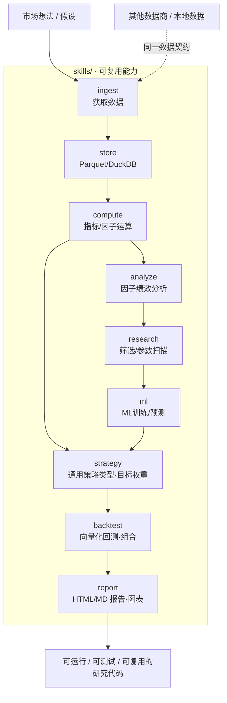

<h1 align="center">QuantSpace</h1>

<p align="center"><b>简体中文</b> | <a href="README.en.md">English</a></p>

<p align="center">面向 AI 时代重新设计的量化投研框架：在项目目录里说清想法，AI 沿着既定工程边界把它落成可运行、可测试、可复用的策略研究代码。</p>

<p align="center">
  
  
  
  
  
</p>

QuantSpace 是面向 AI 时代重新设计的量化投研框架。使用任意 AI coding工具打开本项目目录，直接告诉
AI 想要下载的数据、验证的市场假设、因子灵感、机器学习 label、交易策略、回测约束或报告要求；AI 会沿着既定工程边界，把想法落成可运行、可测试、可复用的策略研究代码。
该项目兼容 ChatGPT Codex、Claude Code、Cursor、CodeBuddy、Qoder、TRAE、OpenCode、OpenClaw、Kimi Code 等主流 AI 编程工具；兼容声明以 README 与 AGENTS.md 为准，运行时按能力发现协作，而不是产品白名单。

真实行情通过默认的 PandaData 开箱可用。外部数据先进入 `skills.ingest`，完成数据获取、数据规范整理，再交给后续模块使用。如果你使用其他数据商或本地数据，只要接入同一套数据契约，后续数据管理、因子计算、策略开发、回测和报告流程就可以继续复用。

QuantSpace 自带一整套可被 AI 调用的 skills：获取数据，本地自动化管理 Parquet 数据
并可用 DuckDB 查询，计算和分析因子，开发规则类与机器学习策略，做组合构建和向量化
回测，再把绩效图表和 HTML 报告沉淀下来。`strategy` 提供横截面与时序策略的通用
类型和目标权重原语，`backtest` 负责统一执行与组合构建，`ml` 负责机器学习训练和预测。
目录下的 `SKILL.md` 会把协作规则写进项目，让新代码优先复用既有模块，而不是散落在一次性的脚本里。

## 架构总览

外部行情先经 `ingest` 归一化进入 `store` 本地仓库，随后被各能力模块按需复用，最终沉淀为报告与可复用策略代码。整条研究回路由 AI 沿着固定的数据契约编排：



## 项目结构

目录结构本身就是框架的一部分：AI 和研究员都能清楚知道，数据接入、通用能力、
策略逻辑、脚本、报告和测试应该分别放在哪里。

```text
quantspace/
  skills/                 可复用能力
    ingest/               获取数据：默认 PandaData 客户端和符号转换
    store/                本地 Parquet 存储、DuckDB 查询和产物管理
    compute/              策略无关的指标、标签、工具与 Factor wrapper
    strategy/             通用策略契约、选取类型与目标权重 helper
    analyze/              因子分析、指标、归因、tearsheet
    backtest/             向量化执行、权重、过滤器、成本
    ml/                   ML 辅助模块和可选模型引擎
    research/             因子筛选和参数扫描
    report/               HTML 报告渲染和图表工具
    factor_mining/        AI 多因子挖掘契约、端口与跨平台角色协议
  strategies/
    cross_sectional/      具体横截面 factors、rules、ML 与 workflows
    time_series/          具体时序 features、rules、ML 与 workflows
  scripts/                全局数据导入、报告和维护入口
  data/                   本地数据根目录；行情和研究产物默认不提交
  reports/                本地生成报告目录；strategy_examples/ 是公开产物例外
  tests/                  按 skills、strategies、scripts 与契约边界组织的公开测试
```

## 公开 Skills

Skills 是 AI 开发策略前应该优先调用的公共能力。

| Skill | 主要导入 | 用途 |
|---|---|---|
| `ingest` | `from skills.ingest import PandaDataClient, FutuClient` | PandaData/Futu 数据接入、标准化和符号转换 |
| `store` | `from skills.store.data_manager import DataManager` | 市场数据、因子、回测、模型元数据 |
| `compute` | `from skills.compute.indicators import trend_score` | 策略无关的 OHLCV 指标、标签、工具与 `Factor` wrapper |
| `strategy` | `from skills.strategy import StrategyResult` | 通用策略契约、选取类型与横截面/时序目标权重 helper |
| `analyze` | `from skills.analyze.factor_analysis import IC_stat` | 因子诊断、归因、稳健性和时间序列检查 |
| `backtest` | `from skills.backtest import VectorBacktester` | 向量化执行、组合权重、过滤器、成本、策略组合、exit 和 overlay 指标 |
| `ml` | `from skills.ml.ml_engine import MLEngine` | ML 训练/推理 |
| `research` | `from skills.research import screen_all_indicators` | 因子筛选和参数扫描 |
| `report` | `from skills.report import ReportRenderer, write_research_bundle` | HTML 研究报告和图表工具 |
| `factor_mining` | `from skills.factor_mining import ResearchBrief, FactorSpec, FactorExecutionAdapter, ResearchController` | AI 多因子挖掘的版本化契约、任意本地 Python 因子生成/解析、四端口、Research Controller 与跨平台角色任务协议 |

每个 skill 目录都有自己的 `SKILL.md` 使用说明。`strategy` 只放可复用的策略类型和
target-weight 原语；具体因子、特征、规则、模型行为和 workflow 放在 `strategies/`。

## 快速开始

环境要求：

- Python `>=3.10`
- `uv`

安装默认环境，生成一份确定性 fixture 数据，然后运行 demo：

```bash
uv sync
uv run python -m scripts.generate_sample_data
uv run python -m strategies.cross_sectional.workflows.run_demo
uv run python -m strategies.time_series.workflows.run_demo
uv run python -m pytest tests/
```

fixture 数据是合成 OHLCV，不需要 PandaData 凭据，结果可复现，也可以随时重新生成。它会写入
`data/market/`；真实研究时，用 PandaData、Futu 或其他遵循同一数据模型的 adapter 导入日线 Parquet 即可。

可选 extras：

```bash
uv sync --extra panda_data  # PandaData SDK
uv sync --extra futu        # Futu OpenAPI SDK
uv sync --extra analyze     # 绘图、时序诊断和并行分析
uv sync --extra ml          # 可选 PyCaret ML 辅助模块
uv sync --extra query       # 可选 DuckDB 查询能力
uv sync --extra report      # Jinja2 与报告图表
```

## PandaData 设置

PandaData 是可选依赖；安装 SDK 并配置凭据后即可取真实行情：

```bash
uv sync --extra panda_data
cp .env.example .env
```

在 `.env` 中填写凭据。`PandaDataClient` 只读取 `PANDA_DATA_*` 凭据变量：

```bash
PANDA_DATA_USERNAME=86xxxxxxxxxxx
PANDA_DATA_PASSWORD=your-password
```

然后试一次小规模导入：

```bash
uv run python -m scripts.import_panda_data_demo \
  --symbol SHSE.600000 \
  --start-date 20230101 \
  --end-date 20231231
```

QuantSpace 使用 `EXCHANGE.CODE` 符号格式，例如 `SHSE.510300`。PandaData 格式可以
通过 helper 转换：

```python
from skills.ingest import to_panda_data_symbol, to_quantspace_symbol

to_panda_data_symbol("SHSE.510300")  # "510300.SH"
to_quantspace_symbol("510300.SH")    # "SHSE.510300"
```

场内 ETF/LOF 行情使用基金接口，不按股票或回测因子获取：

```python
from skills.ingest import PandaDataClient

client = PandaDataClient()
bars = client.get_fund_daily(
    "20250610",
    "20250613",
    symbol="SHSE.510300",
)
```

前、后复权行情分别使用 `get_fund_daily_pre` 和
`get_fund_daily_post`。三个基金日线方法会自动将超过 365 个自然日的区间
分块下载并合并；ETF 申赎数据使用 `get_fund_etf_*`，不包含在此处理范围内。

## Futu 设置

Futu skill 的 CLI 和参考文档已放在 `.agents/skills/futuapi/`。QuantSpace
通过 `skills.ingest.FutuClient` 复用同一个 `futu-api` SDK，并将历史 K 线
标准化后交给 `DataManager` 保存；策略和回测仍然只读取本地 Parquet。

准备 OpenD（版本 >= 10.4.6408）并安装项目可选依赖：

```bash
uv sync --extra futu
```

OpenD 默认监听 `127.0.0.1:11111`，也可以设置 `FUTU_OPEND_HOST` 和
`FUTU_OPEND_PORT`。先导入少量标的验证链路：

```bash
uv run python -m scripts.import_futu_data \
  --symbols SHSE.600519 SZSE.000001 \
  --start-date 2024-01-01 \
  --end-date 2024-12-31 \
  --ktype 1d \
  --rehab none
```

`rehab=none` 写入 `data/market/1d/`；`forward` 或 `backward` 写入
`data/market/1d_adj/`。Futu 历史 K 线按标的消耗额度，导入脚本默认先调用
`get_history_kl_quota` 做额度预检。若只想交互式查看行情，可直接使用
`.agents/skills/futuapi/scripts/quote/get_kline.py`。

## 数据模型

数据模型保持简单明确，方便 AI 生成的策略代码稳定复用。默认布局如下：

```text
data/
  market/{frequency}/{symbol}.parquet
  adj_factor/{symbol}.parquet
  factors/{namespace}/
  factor_test/{namespace}/
  correlation/{namespace}/
  backtest/{namespace}/
  models/{namespace}/
```

每个 OHLCV frame 以 `eob` 为索引，列为：

```text
open, high, low, close, volume
```

品种集合由策略或调用方显式持有，并通过 `read_symbols` 读取：

```python
from skills.store.data_manager import DataManager

panel = DataManager().read_symbols(
    ["SHSE.510300", "SHSE.510500"],
    frequency="1d",
)
```

返回 panel 的 MultiIndex 为 `(symbol, eob)`。因子、回测和模型目录下的第一层名称只是
调用方提供的 artifact namespace，不是由 `DataManager` 维护的品种池。

`DataManager` 使用 `QUANTSPACE_DATA_ROOT`（默认 `data/`）；报告使用
`QUANTSPACE_REPORTS_ROOT`（默认 `reports/`）。需要在仓库外运行整个工作区时，还可以设置
`QUANTSPACE_WORKSPACE_ROOT`。三个路径都由 `resolve_workspace_paths()` 统一解析。

## 策略示例

示例展示的是推荐工作方式：通用策略类型放在 `skills.strategy`，具体 factors、features、
rules、ML 权重函数与 workflow 放在 `strategies/`，统一执行交给 `VectorBacktester`。

### 横截面轮动

流程：

```text
panel OHLCV -> concrete factors/rules -> target weights -> VectorBacktester -> metrics
```

运行：

```bash
uv run python -m strategies.cross_sectional.workflows.run_demo
```

这个示例通过 `skills.strategy.cross_sectional.ModularBacktester` 组合简单动量和低波动因子，
数据来自 demo 显式品种列表对应的 `data/market/1d/` 日线 Parquet。

### Time-Series ML

流程：

```text
raw OHLCV bars -> feature engineering -> triple-barrier labels -> model -> backtest
```

运行：

```bash
uv run python -m strategies.time_series.workflows.run_demo
```

这个示例使用 `strategies.time_series.features.make_price_volume_features`、
`TripleBarrierLabelMaker`、一个小型 scikit-learn 分类器、
`skills.strategy.time_series.signal_to_single_asset_weights`、date × symbol 权重矩阵和
`skills.backtest.VectorBacktester`，数据来自已有单品种日线 Parquet。

### 示例策略报告

```bash
uv run python -m scripts.run_strategy_reports
```

这个薄编排脚本会读取 `data/market/1d/` 下已有的 PandaData 日线 Parquet；可用
`--data-root` 指向另一份本地数据，并在解析后的 reports root 的 `strategy_examples/` 下写出
4 份公开策略报告和绩效图。横截面策略族包含期货规则和
期货 XGBoost 排序，时序策略族包含一个规则类示例和一个
XGBoost 示例。策略逻辑放在 `strategies/`；通用选取和 target-weight 类型位于
`skills.strategy`；存储、向量化执行、回测指标、ML helper 和报告渲染位于其他 `skills/`。

下面是脚本生成的 4 份公开示例绩效图（基于真实历史行情回测，**仅用于演示框架能力，不代表未来收益，也不构成任何投资建议**）：

<table>
<tr>
<td width="50%" align="center">
<br>
<sub><b>CSI 300 IF · MA10 ATR 反转</b><br/>规则 / 时序 · 示例区间 2024 +22.1% · 2025 +36.3%</sub>
</td>
<td width="50%" align="center">
<br>
<sub><b>CSI 300 IF · XGBoost 三重障碍</b><br/>ML / 时序 · 示例区间 2024 +12.9% · 2025 +4.9%</sub>
</td>
</tr>
<tr>
<td width="50%" align="center">
<br>
<sub><b>期货横截面反转</b><br/>规则 / 横截面 · 示例区间 2024 +30.8% · 2025 +31.4%</sub>
</td>
<td width="50%" align="center">
<br>
<sub><b>期货 XGBoost 排序</b><br/>ML / 横截面 · 示例区间 2024 +18.7% · 2025 +45.7%</sub>
</td>
</tr>
</table>

> 上述区间收益来自 `reports/strategy_examples/` 下的公开示例报告，基于历史行情回测，受数据窗口、参数与样本范围影响，**不构成收益承诺或投资建议**。完整指标见对应的 `<slug>/index.html` 报告。

## 文档索引

需要了解 README 背后的细节时，可以继续阅读：

- [PandaData 接入](docs/panda_data_ingest.md)

## 开发与验证

交付改动前运行公开测试：

```bash
uv run python -m pytest tests/
uv run ruff check .
```

发布前还应执行 release safety scan，检查私有路径、凭证、私有策略名称和已经移除的
研究型模块是否误入仓库。生成的数据和私有研究报告应留在本地；开源仓库中只保留代码、
文档、测试、小型模板，以及 `reports/strategy_examples/` 下经过脱敏
的公开示例报告。

## 数据来源与假设

- 默认数据来源为 PandaData；也可接入其他数据商或本地数据，只要遵循相同的数据契约。
- 仓库内置的 fixture 数据为合成 OHLCV，仅用于演示与可复现测试，不代表真实行情。
- 框架不附带任何已验证收益的策略；`strategies/` 与 `reports/strategy_examples/` 下的内容均为示例。

## 限制与风险边界

- QuantSpace 是研究与工程框架，不是自动交易系统，不接券商接口，不执行订单。
- 因子、策略、回测和报告输出仅为研究材料，受数据窗口、参数选择和样本范围限制。
- 是否用于真实交易，需由用户结合自己的策略、风控和执行流程独立判断。

## 免责声明

本仓库仅作量化研究方法与工程框架整理，不验证任何收益声明，不构成任何投资建议。请勿将框架或其示例输出直接作为投资决策依据。

## License

This project is licensed under the GNU General Public License v3.0. See [LICENSE](LICENSE).

## 项目创始人与 🐼 PandaAI / QUANTSKILLS 社群二维码

<table align="center">
  <tr>
    <td align="center">
      <br>
      <sub>扫码添加微信，针对本项目提问。</sub>
    </td>
    <td align="center">
      <strong>PandaAI / QUANTSKILLS 社群</strong><br>
      <br>
      <sub>扫码加入社群，交流 QUANTSKILLS 技能、Agent 工作流与量化研究实践。</sub>
    </td>
  </tr>
</table>
